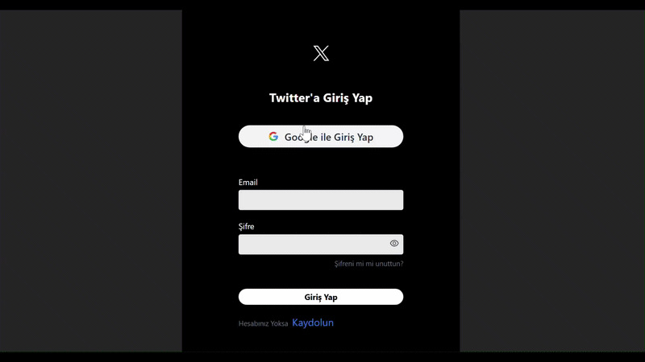

# 🐦 Twitter Clone (React 19 + Firebase + Tailwind 4)


Bu proje, en güncel web teknolojileri ve Firebase servisleri kullanılarak geliştirilmiş gerçek zamanlı bir sosyal medya uygulamasıdır. Kullanıcılar metin ve görsel içeren paylaşımlar yapabilir, veriler anlık olarak bulut üzerinde depolanır.

 ##📱 Demo

 
## 🛠 Teknik Teknoloji Yığını (Tech Stack)

*   **Çekirdek:** `React 19` & `Vite 7` (Modern ve hızlı geliştirme)
*   **Stil Yönetimi:** `Tailwind CSS v4` (En yeni CSS standartları)
*   **Backend as a Service (BaaS):** `Firebase v12` (Firestore & Storage)
*   **Yönlendirme:** `React Router Dom v7`
*   **Zaman Yönetimi:** `Moment.js`
*   **Geri Bildirim:** `React Toastify`
*   **İkon Seti:** `React Icons`
*   **Benzersiz ID:** `UUID`

## ✨ Öne Çıkan Özellikler

- **Tweet Paylaşımı:** Metin ve görsel desteğiyle içerik oluşturma.
- **Görsel Önizleme:** Paylaşım öncesi `URL.createObjectURL` ile anlık resim önizleme ve iptal etme.
- **Dinamik Zaman Gösterimi:** Tweetlerin atılma zamanını "3 dakika önce" gibi okunabilir formatta gösteren `moment.js` entegrasyonu.
- **Düzenleme Göstergesi:** `isEdited` durumuna göre masaüstü ve mobilde farklılaşan görsel bilgilendirme.
- **Performans:** `React.memo` ile gereksiz render'ların önlenmesi ve `useRef` ile optimize edilmiş form yönetimi.

## 📁 Proje Dosya Yapısı
```text
src/
 ├── components/       # Atomik bileşenler (UserAvatar, Form, UserInfo...)
 ├── firebase/         # Firebase yapılandırması ve Storage yükleme fonksiyonları
 ├── utils/            # Yardımcı fonksiyonlar (getUserName, helpers...)
 ├── styles/           # Tailwind CSS yapılandırması
 └── assets/           # Statik dosyalar


## 1. Bağımlılıkları Yükleyin:

-Bash

npm install

## 2. Geliştirme Sunucusunu Başlatın:

Bash

npm run dev